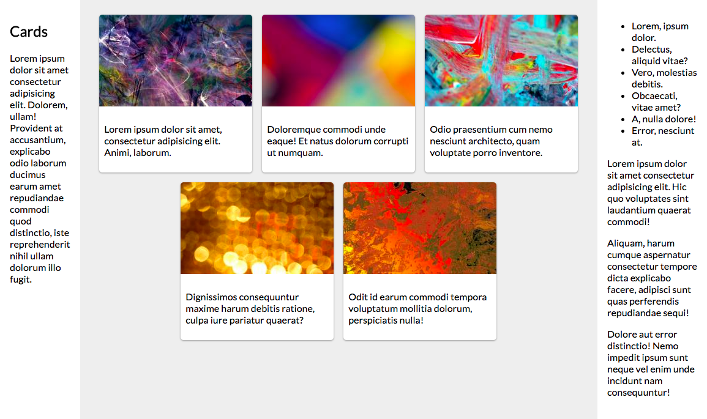

# Exercise 2

In this exercise, you'll practice working with CSS "containers" and the Flexbox framework to make complex layouts.

To complete the exercise, you will need to modify the provided `index.html` and `css/style.css` files in order to layout the content as columns of [cards](https://material.io/guidelines/components/cards.html):



Instructions for achieving this appearance are detailed below. Note that you will need to edit both the HTML _and_ the CSS file. I have already provided some simple formatting (fonts, etc) for you.

1. Each `<section>` should be its own column in a _three-column_ layout. Use the Flexbox framework to create this structure.

    - You will need to create a "container" element (e.g., a `<div>`) to hold the Flexbox (with `display: flexbox`), and then make each `<section>` into a "item". You can use CSS classes to help style the sections.

    - The columns should be sized as follows:

        - The first section should have a [base](https://css-tricks.com/snippets/css/a-guide-to-flexbox/#article-header-id-12) size of `240px`. (A width relative to the browser would be more flexible but make it hard to isolate changes).
        - The second section should [grow](https://css-tricks.com/snippets/css/a-guide-to-flexbox/#article-header-id-10) to fill the remaining space. This column should also have a background color of `#eee`.
        - The third section should have a base size of `180px`, but also should _not_ [shrink](https://css-tricks.com/snippets/css/a-guide-to-flexbox/#article-header-id-11) if the window gets small. (You can test this out by resizing the browser and watching the text reflow!)

    - Additionally, give each column `1em` of padding there is some space between the edges. Can you avoid duplicating properties?

    - Remember to specify your box-sizing to make sure the measurements are correct!

2. The images in the second section will need to be made into "cards". To do this, you will need to define that section as into _another_ Flexbox container, in which each card can be a Flexbox item.

    - You should add another `<div>` to act as the Flexbox container, rather than trying to make the `<section>` itself into a Flexbox.

    - Each card contains both an image and text. Add `<div>` elements to "group" the content into a Flexbox item.

    - Each card should have a base size of `250px` (the same size as the image), and should neither grow nor shrink based on the available space. Can you use a single property to declare this?

    - If the cards can't fit onto a single line, they should [wrap](https://css-tricks.com/snippets/css/a-guide-to-flexbox/#article-header-id-4) to the next.

    - [Justify](https://css-tricks.com/snippets/css/a-guide-to-flexbox/#article-header-id-6) the cards so that they match the sample image (note -- you may need to adjust your screensize to replicate the effect)

    - Give each card a white background and add `.5rem` of spacing between them.

3. The next step is to style the cards, giving them some spacing, (subtle) rounded corners, and a drop-shadow!

    - The text content of the cards should have and additional `1rem` of space on the sides, and `.5rem` of space on the top and bottom. However, there should be _no_ space between the image and the edge of the cards.

    - Each card should have [rounded corners](https://developer.mozilla.org/en-US/docs/Web/CSS/border-radius), with a radius of `6px` on all 4 sides. (It's a subtle effect; experiment with a `10px` radius to see it more clearly). 
    
        The image at the top of the card will _also_ need to have rounded corners... but only on the top of the image--the bottom of the image should be flat with the text content. Use multiple property values (similar to padding, margin, and border) to specify different radii for different corners.

    - Finally, create a shadow effect by adding 2 [drop-shadows](https://developer.mozilla.org/en-US/docs/Web/CSS/box-shadow?v=b) to each card. The two shadows will be interpolated to create a single effect (simply use a comma-separated list of values to specify them). Each shadow should have an `x-offset` of 0, a `y-offset` of `1px`, and a `blur-radius` of `3px`. The first shadow should be black with a <a href="https://developer.mozilla.org/en-US/docs/Web/CSS/color_value#rgb()_and_rgba()">transparency alpha</a> of `.16`, and the second should be black with an alpha of `.23`.

        (These numbers are adapted from examples, hence the odd specificity).

4. If your window is big enough, you may have noticed that the center column's gray background doesn't always stretch all the way to the bottom. In fact, it only goes as far down as the content of the "outer" flexbox (which is usually the size of the text-heavy third column). It is possible to fix this by using---you guessed it!---another Flexbox!

    - To do this, you will need to make the _entire body_ into a Flexbox container (but in the `column` direction!) that contains a single item: the `<main>` content of the page. That item should have a grow factor of `1` so it fills up the remaining space in the page!

    - However, you'll also need to make sure that the columns actually fill the height of the screen. To do this, you need to give a `height:100%` property to the root `<html>` and `<body>` elements in order to have the "window height" be inherited. You'll also need to give the Flexbox parent for the columns a `height:100%` so that it knows to fill up its parent (the `<main>` tag, which will grow to fill the body!)


## Testing
This exercise includes a test suite to verify that the outputted web page looks as expected. Note that this uses pixel-based image comparison, so may not fully reflect your solution's accuracy.

_This test suite has been tested on Mac machines_.

First, you will need to install an additional library called [Puppeteer](https://github.com/GoogleChrome/puppeteer). Note that this it will download a recent version of Chromium (~71Mb Mac, ~90Mb Linux, ~110Mb Win)

```
npm install puppeteer
```

You can then run the test suite with. Note that it can take around **2 minutes** for this suite to run completely. 

**Warning**: If you specify _all_ possible related CSS properties (i.e., `padding-left`, `padding top`, `padding-left`, _and_ `padding-right`) you will get [this](https://stylelint.io/user-guide/rules/declaration-block-no-redundant-longhand-properties/) testing error. 

```bash
jest exercise-2
```
