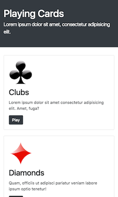
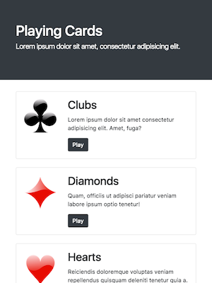
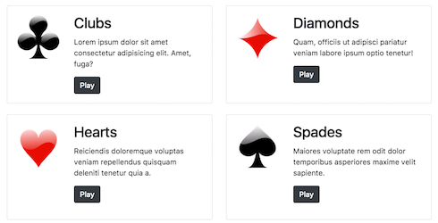
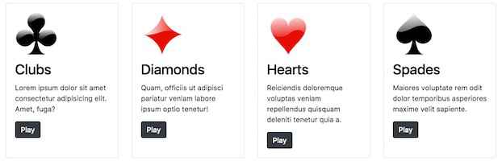

# Exercise 4

In this exercise, you'll practice styling a page using the **Bootstrap** CSS framework, and its responsive grid system in particular..

To complete the exercise, you will need to add structural content (e.g., `div` elements) and utility classes to the included `index.html` file so that it has has the following responsive appearance. Note, in creating the layouts below, you will **only edit** the `index.html` file (**no CSS changes**):

- On extra-small screens (less than `598px` in width):

    

- On small screens (more than `598px` in width), the images move to the sides of the text:

    

- On medium and large screens (more than `768px` in width), the cards arrange into a 2x2 grid:

    

- On extra-large screens (more than `1200px` in width), the cards line up in a single row, with the images back on top:

    

Instructions for achieving this appearance are detailed below:

1. Start by including a `<link>` to the Boostrap 4 CSS framework in the document's `<head>`. This should add some simple font styling to the page.

    - You'll also need to add a `viewport` meta element, as in the previous responsive exercise.

2. The content inside of the `header`  `main` elements should be wrapped inside of Bootstrap [containers](https://getbootstrap.com/docs/4.0/layout/overview/#containers) to give them appropriate padding. Note that this step (and the entire exercise) may require you to "wrap" groups of elements into `div`s.

3. The header should be a [Jumbotron](https://getbootstrap.com/docs/4.0/components/jumbotron/) component (specifically, a _fluid_ jumbotron).

    - The "subtitle" should be stand out as a [lead](https://getbootstrap.com/docs/4.0/content/typography/#lead)

    - The header jumbotron should be [colored](https://getbootstrap.com/docs/4.0/utilities/colors/) with a "dark" background and "white" text.

4. Each of the "cards" indicated in the HTML should be styled as a [Card](https://getbootstrap.com/docs/4.0/components/card/) component. Yes, this means you will need to make the same set of changes 4 times... consider it practice!

    - Each card's content should be have [appropriate padding](https://getbootstrap.com/docs/4.0/components/card/#body).

    - Use the `.card-title` and `.card-text` classes to style the card's title and text respectively.

    - The "Play" links should be styled as [dark-colored buttons](https://getbootstrap.com/docs/4.0/components/buttons/) (but they should remain links!)

    - Use a [utility class](https://getbootstrap.com/docs/4.0/utilities/spacing/) to give the `` elements _bottom padding_ equal to the "spacer" size (a spacing size of `3`).

    - Also give each _`.card`_ 1.5 "spacers" worth of _bottom margin_ (a spacing size of `4`). This will put space between the cards (you'll also do this by adding a utility class)

5. By default the cards will be lined up in a 1x4 stack. However, on larger devices they should be arranged in a 2x2 or 4x1 grid. To support this, place all of the cards into a single `.row` of a Bootstrap [Grid](https://getbootstrap.com/docs/4.0/layout/grid/). You'll need to **wrap each `.card`** element in a `div` in which you specify the proper column classes below. This will help apply the desired spacing. 

    - On _medium_ or larger screens, each card (wrapper column) should take up 1/2 of the row (e.g., 6 "columns"). On _extra-large_ or larger screens, each card should take up 1/4 of the row.

    - You can make each card the same "height" on larger displays by make each card (wrapper column) it's own [flexbox container](https://getbootstrap.com/docs/4.0/utilities/flex/) (e.g., via a utility class that gives the `display:flex` property). This will cause the content to "fill" the parent element (which is the `.row`!)

6. When there is sufficient room (e.g., on _small_, _medium_, or _large_ displays), the image icon should sit to the left side of the text. The easiest way to do this to make the **body of the card** into _another_ grid! Then you can use the responsive sizing utilities to put the image into a different "column" than the rest of the content!

    - _For each card_, you will need to wrap the content inside of another `.row`. Inside of the row, you should group the content into two child "columns" (i.e., `div` elements): one containing the ``, and one containing the rest of the content.

    - On _small_ or larger displays, the column containing the image should have an `auto` calculated width, and the column containing the header/text should have a width that takes up the remaining space. You can achieve this by using the [natural width](https://getbootstrap.com/docs/4.0/layout/grid/#variable-width-content) of the `img` element.

    Note that this will cause the card content to be in "columns" on small or larger devices... but on extra-large displays the overall `container` sizing means that each card isn't large enough for them to be in columns, so they will go back to stacking as desired!

## Testing
This exercise includes a test suite to verify that the outputted web page looks as expected. 


```bash
# Run from the *parent* directory
jest exercise-4.spec.js
```
